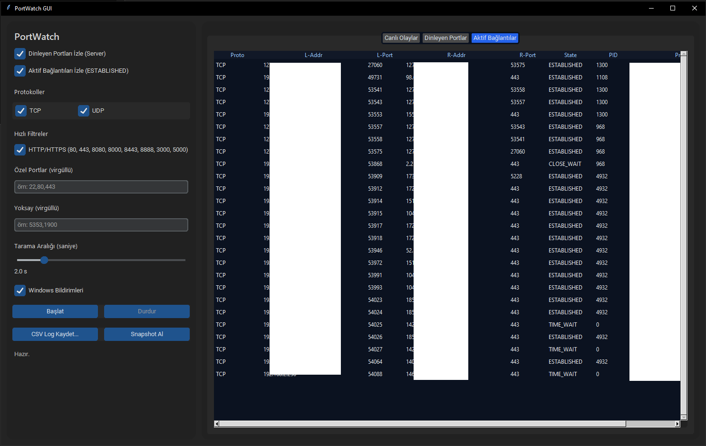

⚡ PortWatch GUI
=================

Windows için **koyu temalı, modern (Metro/Fluent hissiyatlı) port & bağlantı izleyici**.  
Ağ bağlantılarını gerçek zamanlı takip etmenizi, şüpheli bağlantıları engellemenizi ve loglamanızı sağlar.  

✨ Özellikler
------------
- 🔍 **Canlı İzleme**: TCP/UDP dinleyen portlar ve aktif bağlantılar (ESTABLISHED vb.)  
- 🖱️ **Sağ Tık İşlemleri**:
  - Program ↔ IP engelle  
  - Programı tamamen engelle  
  - Engeli kaldır  
  - Tüm PortWatch engellerini temizle  
- 📸 **Snapshot**: Anlık olarak tabloyu yenile  
- 📑 **CSV Loglama**: Olayları CSV’ye kaydet  
- 📋 **Kopyalama**: Hücre veya kolon kopyalama  
- 🚀 **Otomatik Yönetici Yükseltme** (UAC ile)  
- 🔔 **Windows Bildirimleri** (opsiyonel)  

🎯 Neden Kullanmalı?
--------------------
- 🛡️ **Güvenlik** → Şüpheli bağlantıları anında tespit edip engelleyebilirsiniz.  
- 📊 **Şeffaflık** → Hangi program hangi IP’ye bağlanıyor görebilirsiniz.  
- ⚡ **Hızlı Aksiyon** → Sağ tık ile anında firewall kuralı ekleyebilirsiniz.  
- 🗂️ **Loglama** → Geçmiş ağ aktivitelerini inceleyebilirsiniz.  
- 🎨 **Modern Arayüz** → Fluent / Metro tarzı koyu tema, kullanıcı dostu tasarım.  

⚙️ Gereksinimler
----------------
pip install customtkinter psutil win10toast

🖥️ Çalıştırma
--------------
python portwatch_gui.py

> Not: Script otomatik olarak yönetici (admin) yetkisi ile yeniden başlar.  

📦 EXE Olarak Derleme
---------------------
pyinstaller -F -w --uac-admin portwatch_gui.py

📸 Ekran Görüntüsü
------------------

📜 Lisans
---------
MIT License 📝
